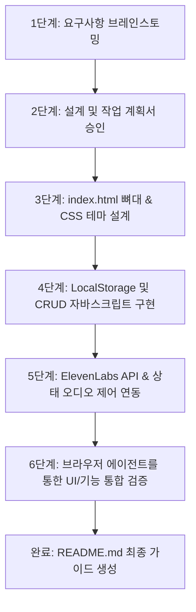

# 마음의 목소리 (DearVoicer) 사용 설명서

본 문서는 사용자의 텍스트를 감성적인 AI 목소리로 출력해주는 개인 맞춤형 TTS 웹 애플리케이션 **마음의 목소리 (DearVoicer)**의 기획안, 구현 과정, 사용 방법 및 실행 정보를 정리한 종합 안내 파일입니다.

---

## 📋 1. 앱 기획안 (Overview)

* **기획 취지**: 발화에 어려움이 있거나, 휠체어 사용 등으로 빠른 텍스트 입력 후 자연스러운 음성 전달이 필요한 사용자를 돕기 위해 개발된 모바일 특화 웹앱입니다.
* **핵심 기능**:
  1. **고품질 TTS**: 세계 최고 수준의 AI 음성 엔진 ElevenLabs API 연동.
  2. **개인 보안 강화**: API Key와 Voice ID를 소스 코드에 남기지 않고, 브라우저 개인 공간(`localStorage`)에 암호화하여 로컬 보관.
  3. **재생 미세 제어**: 생성 대기(Loading) 상태 및 오디오 재생 도중 언제든지 정지할 수 있는 취소(Stop) 기능 지원.
  4. **속도 조절 고도화**: 슬라이더 외에 `0.8x(느리게)`, `1.0x(보통)`, `1.2x(빠르게)` 퀵 프리셋 버튼 및 `+/-` 미세 조절 버튼 제공.
  5. **자주 하는 말 CRUD**: 기본 제공 문구 외에 사용자가 대표 이모지와 대사를 직접 추가/삭제할 수 있는 커스텀 데이터베이스 구축.
  6. **프리미엄 디자인 & 다크 모드**: HSL 기반의 세련된 크림/오렌지 테마와 야간 시인성을 높인 다크 모드 지원.

---

## 🛠️ 2. 구현 과정 (Implementation Process)

본 프로젝트는 **스펙 주도 개발(Spec-Driven Development)** 방식을 기반으로 철저하게 안전성을 검증하며 100% 순수 Vanilla HTML/CSS/JS 단일 파일 구조로 개발되었습니다.



1. **테마 및 UI 토큰 정의**: CSS 변수(`--primary`, `--bg-app` 등 HSL 기반)를 활용하여 다크 모드 전환 시 웹 앱의 전체 배색이 부드럽고 가독성 있게 즉시 변환되도록 구현.
2. **상태 머신 오디오 제어**: API 전송 중(버튼 내 회전 로딩 스피너 작동 및 비활성화) -> 재생 중(🛑 멈추기 버튼 전환 및 클릭 시 오디오 즉각 중단) -> 대기 중(📢 말하기 복귀) 상태 흐름 설계.
3. **사용자 편의 인터페이스 개발**: 슬라이더 조작 시 0.1 배속 단위로 슬라이더와 텍스트 배지가 유기적으로 움직이도록 설계하고 퀵 프리셋 작동 연동.
4. **브라우저 시각 검증**: 브라우저 자동화 검증 도구를 통해 모바일 화면 뷰에서의 테마별 깨짐 현상, 모달 레이어 팝업 애니메이션 효과 검증 완료.

---

## 📖 3. 상세 사용 방법 (How to Use)

### ① 첫 실행 시: API 설정하기 (최초 1회)
1. 우측 상단의 **톱니바퀴(⚙️) 아이콘**을 클릭해 설정 창을 엽니다.
2. 본인의 ElevenLabs 계정에서 발급받은 **API Key**와 사용할 목소리의 **Voice ID**를 입력합니다.
3. 아래의 주황색 **[저장]** 버튼을 누릅니다. (저장된 값은 브라우저에 저장되어 매번 적지 않아도 유지됩니다.)

> 💡 **빠른 테스트용 기본 목소리 ID 리스트**
> 아직 본인의 목소리를 복제하지 않았다면 아래 ElevenLabs 공식 무료 목소리 ID 중 하나를 복사해서 **Voice ID** 란에 넣어 테스트해 보세요.
> * **Rachel (여성, 차분한 나레이션)**: `21m00Tcm4TlvDq8ikWAM`
> * **Adam (남성, 중저음 나레이션)**: `pNInz6obpgqIyv21rWt2`
> * **Domi (여성, 활기찬 톤)**: `AZnzlk1XvdvUeBnXmlld`
> * **Antoni (남성, 부드러운 톤)**: `ErXwobaYiN019PkySvjV`

### ② 대화하기 (말하기 & 멈추기)
1. 중앙의 흰색 입력창에 상대방에게 하고 싶은 말을 작성합니다. (우측 하단에 글자 수가 실시간으로 표시됩니다.)
2. 주황색 **[📢 말하기]** 버튼을 누릅니다.
3. 음성이 생성되어 재생될 때, 소리를 멈추고 싶다면 빨갛게 바뀐 **[🛑 멈추기]** 버튼을 누르면 즉시 음성이 차단됩니다.
4. 입력창을 전부 비우고 싶을 땐 왼쪽의 **[지우기]** 버튼을 누릅니다.

### ③ 자주 하는 말 활용 및 문구 편집
* **말하기**: 화면 아래쪽 그리드 카드를 누르면 입력창에 문구가 즉시 채워지며 음성이 자동으로 실행됩니다.
* **문구 추가**: `자주 하는 말` 우측의 **`+ 문구 추가`**를 눌러, 원하는 대표 이모지(예: 👋)와 문장을 입력한 뒤 추가합니다.
* **문구 삭제**: 각 카드 우측 상단에 마우스를 올리면(모바일은 카드 우측 영역 터치) 나타나는 **작은 `×` 아이콘**을 누르면 목록에서 즉시 지워집니다.

### ④ 재생 속도 조절
* `느리게 (0.8x)`, `보통 (1.0x)`, `빠르게 (1.2x)` 프리셋 버튼을 눌러 속도를 즉각 변경할 수 있습니다.
* 미세하게 조절하고 싶을 땐 양쪽의 `-` 및 `+` 버튼을 누르면 0.1 배속 단위로 정밀하게 변경됩니다.

---

## 🔗 4. 실행 방법 (Run Application)

본 프로그램은 가볍고 완전하게 동작하는 단일 HTML 파일로 구성되어 있습니다. 아래 링크를 클릭하거나 경로를 브라우저 주소창에 넣으면 즉시 실행됩니다.

* **👉 [DearVoicer 웹 앱 실행하기](file:///c:/Users/kikin/Projects/antigravity-DearVoicer-app/index.html)**

### 로컬 파일 절대 경로
```text
file:///C:/Users/kikin/Projects/antigravity-DearVoicer-app/index.html
```
